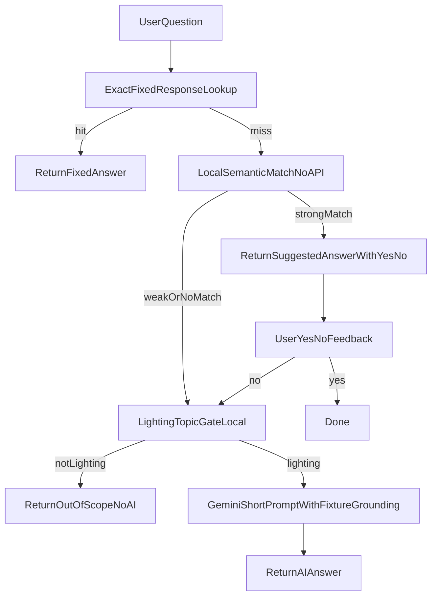

# Chat-with-LuxSCale Implementation Plan

## Confirmed decisions
- Chat API access: **public**.
- Fixed responses lifecycle: **generate editable JSON + provide regenerate script/endpoint**.

## Target architecture
- Frontend page: [`c:/xampp/htdocs/LuxScaleAI-zetta/chat-with-luxSCale.html`](c:/xampp/htdocs/LuxScaleAI-zetta/chat-with-luxSCale.html)
- API routes + orchestration:
  - [`c:/xampp/htdocs/LuxScaleAI-zetta/luxscale/ai_routes.py`](c:/xampp/htdocs/LuxScaleAI-zetta/luxscale/ai_routes.py)
  - new service modules under `luxscale/` for chat logic and response generation
- Data sources for fixed responses and fixture grounding:
  - [`c:/xampp/htdocs/LuxScaleAI-zetta/standards/standards_cleaned.json`](c:/xampp/htdocs/LuxScaleAI-zetta/standards/standards_cleaned.json)
  - [`c:/xampp/htdocs/LuxScaleAI-zetta/standards/standards_keywords_upgraded.json`](c:/xampp/htdocs/LuxScaleAI-zetta/standards/standards_keywords_upgraded.json)
  - [`c:/xampp/htdocs/LuxScaleAI-zetta/assets/fixtures_online.json`](c:/xampp/htdocs/LuxScaleAI-zetta/assets/fixtures_online.json)
  - [`c:/xampp/htdocs/LuxScaleAI-zetta/assets/fixture_map_SC_IES_Fixed_v3.json`](c:/xampp/htdocs/LuxScaleAI-zetta/assets/fixture_map_SC_IES_Fixed_v3.json)
  - [`c:/xampp/htdocs/LuxScaleAI-zetta/ies-render/ies.json`](c:/xampp/htdocs/LuxScaleAI-zetta/ies-render/ies.json)
- Gemini provider config/runtime:
  - [`c:/xampp/htdocs/LuxScaleAI-zetta/gemini_config.json`](c:/xampp/htdocs/LuxScaleAI-zetta/gemini_config.json) (managed by existing manager)
  - [`c:/xampp/htdocs/LuxScaleAI-zetta/luxscale/gemini_manager.py`](c:/xampp/htdocs/LuxScaleAI-zetta/luxscale/gemini_manager.py)

## Step-by-step implementation

### 1) Add editable fixed response store + schema
- Create [`c:/xampp/htdocs/LuxScaleAI-zetta/assets/fixed_responses.json`](c:/xampp/htdocs/LuxScaleAI-zetta/assets/fixed_responses.json) with sections:
  - `version`, `updated_at`
  - `menu_items` (question labels for review/edit)
  - `responses` (canonical `id`, question variants, answer text, tags)
  - `match_hints` (keywords/synonyms)
- Keep answers short and brand-aligned; include explicit source tags (`standards`, `fixtures`, `ies`) for traceability.

### 2) Build fixed response generator from project data
- Add new module (e.g. `luxscale/fixed_responses_builder.py`) to generate/update `assets/fixed_responses.json` from:
  - standards rows/keywords
  - fixture map + online product metadata
  - IES index high-level metadata
- Add regenerate entrypoint (script and optional endpoint) so you can rebuild after DB updates.
- Ensure generator preserves manual edits where intended (merge strategy: deterministic IDs + patchable answer text).

### 3) Implement chat service with 3 fallbacks (no UI yet)
- Add new module (e.g. `luxscale/chat_service.py`) with:
  - `exact_fixed_match(question)`
  - `semantic_fixed_match(question)` (local normalization/token overlap/fuzzy score)
  - `lighting_topic_gate(question)` (local logic only; no external API calls)
  - `gemini_answer(question, context)` using existing Gemini manager config/accounts
- Add per-session pending suggestion state (in-memory store keyed by session/chat id) to support yes/no follow-up safely.

### 4) Add public chat endpoints in AI routes
- Extend [`c:/xampp/htdocs/LuxScaleAI-zetta/luxscale/ai_routes.py`](c:/xampp/htdocs/LuxScaleAI-zetta/luxscale/ai_routes.py) with public routes like:
  - `POST /api/chat/ask`
  - `POST /api/chat/feedback` (handles `yes` / `no` on suggested fixed answer)
  - `POST /api/chat/fixed-responses/regenerate` (script-driven rebuild; optionally admin-protected toggle)
- Response contract includes:
  - `source`: `fixed_exact | fixed_suggested | fixed_confirmed | out_of_scope | gemini`
  - `requires_confirmation` + suggested answer payload when applicable
  - `show_yes_no` flag for frontend

### 5) Implement Gemini fallback constraints and prompt policy
- Use existing gemini manager accounts from `gemini_config.json`.
- Add strict local gate:
  - if question is not lighting-related, return out-of-scope response and **do not call Gemini**.
- For lighting questions, use a fixed short-response prompt template.
- Add fixture-grounding block: when recommendation is needed, constrain to your fixture catalog/map and include concise parameters + image + official Short Circuit link when available.

### 6) Wire frontend chat page to backend contract
- Update [`c:/xampp/htdocs/LuxScaleAI-zetta/chat-with-luxSCale.html`](c:/xampp/htdocs/LuxScaleAI-zetta/chat-with-luxSCale.html):
  - replace mock reply logic with `fetch('/api/chat/ask')`
  - render suggested answer confirmation controls (Yes/No)
  - on No, call `/api/chat/feedback` then trigger fallback flow
  - display source badges (`Fixed`, `Suggested`, `AI`) for transparency

### 7) Add safety, observability, and basic abuse controls
- Add lightweight safeguards for public endpoint:
  - request size cap
  - basic per-IP cooldown / in-memory throttle
  - strict JSON validation
- Add structured logging for source path chosen and Gemini usage decisions (without leaking secrets).

### 8) Validate with scenario tests
- Test matrix:
  - exact fixed question
  - paraphrased fixed question + yes path
  - paraphrased fixed question + no path -> Gemini
  - non-lighting question -> blocked from Gemini
  - fixture recommendation question -> catalog-constrained recommendation output with parameters/image/link
- Confirm no Gemini call is made in non-lighting path.

## Key output artifacts
- Editable fixed response DB: `assets/fixed_responses.json`
- Regenerator module/command for re-building it from standards+fixtures+IES
- Public chat API routes with explicit fallback source reporting
- Frontend integration with yes/no confirmation UX