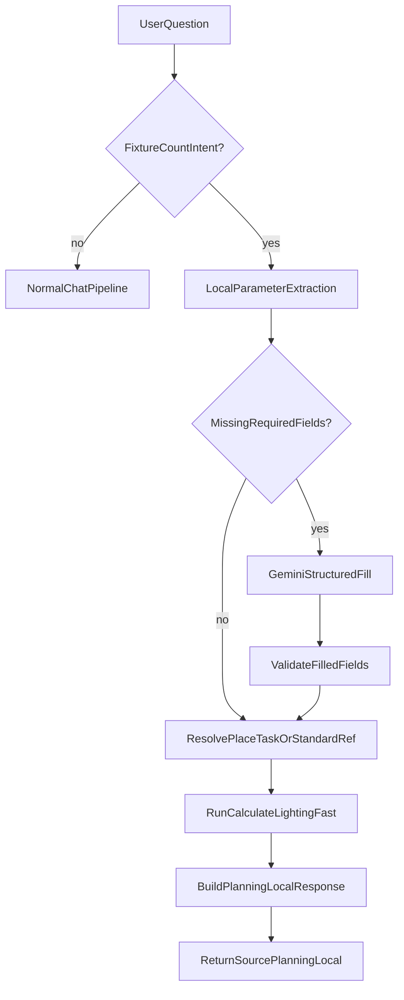

# خطة تحسين منطق حساب التركيبات في الشات

## الهدف
- أي سؤال من نوع “how many fixtures” (بأي صياغة) يجب أن يذهب أولًا لمسار `planning_local` وليس `fixed_exact`.
- الحسابات يجب أن تستخدم نفس منطق المحرك الأساسي في المشروع (`calculate_lighting`) لضمان تطابق النتائج مع LuxScale.
- استخراج `sides`, `category`, `task_or_activity` محليًا أولًا، ثم Gemini فقط لاستكمال النواقص.

## المشكلة الحالية (Root Cause)
- في [`luxscale/chat_service.py`](luxscale/chat_service.py) ترتيب `handle_question` يمر على `_find_place_standard_response` قبل `_local_fixture_count_guidance`.
- صياغات مثل `if i have ... inside factory` تُلتقط عبر `_detect_identity_as_place` وتُعاد كـ`fixed_exact` (معيار المصنع) قبل الوصول لحساب عدد التركيبات.

## Phase 1: تصحيح ترتيب القرار (Routing Priority)
- تعديل `handle_question` في [`luxscale/chat_service.py`](luxscale/chat_service.py) بحيث:
  - يتم فحص intent الخاص بعدد التركيبات مبكرًا (قبل place standard fixed response).
  - عند وجود أبعاد + intent تركيبات، يكون المسار الإجباري `planning_local`.
- إضافة policy واضحة:
  - `fixture_count_intent` يعلو على `place_standard_response`.
  - `place_standard_response` يستخدم فقط عندما السؤال لا يطلب عدد التركيبات.

## Phase 2: استخراج المعطيات محليًا (Local Parameter Resolver)
- بناء extractor محلي من نص السؤال في [`luxscale/chat_service.py`](luxscale/chat_service.py):
  - `dimensions`: دعم `L*W*H`, `L x W x H`, الأقواس، والوحدات.
  - `sides`: اشتقاق افتراضي مستطيل `[L, W, L, W]` عند توفر L/W فقط.
  - `place/category`: باستخدام `_detect_place_canonical` + aliases.
  - `task_or_activity`/`ref_no`: matching من `standards_cleaned` و`standards_keywords` محليًا.
- استخدام alias/keyword mapping من:
  - [`standards/aliases_upgraded.json`](standards/aliases_upgraded.json)
  - [`standards/standards_keywords_upgraded.json`](standards/standards_keywords_upgraded.json)

## Phase 3: توحيد الحسابات مع محرك LuxScale الأساسي
- بدل الاعتماد على التقدير المبسط فقط، ربط الشات مع الحساب الأساسي:
  - استخدام `calculate_lighting` من [`luxscale/lighting_calc/calculate.py`](luxscale/lighting_calc/calculate.py).
  - نفس مسار target resolution المستخدم في [`app.py`](app.py) (`standard_row` أو `place`).
- عند توفر `standard_ref_no` أو `task` محليًا:
  - تمرير `standard_row` مباشرة.
- عند توفر `place` فقط:
  - استخدام mapping واضح إلى preset/place أو best standard task ثم حساب.
- اعتماد `fast=True` في الشات للحفاظ على زمن الاستجابة.

## Phase 4: Gemini كـFallback Structured فقط عند النقص
- إذا فشل الاستخراج المحلي في حقول أساسية (`sides`, `height`, `place/task`):
  - استدعاء Gemini لاسترجاع JSON منظّم فقط (بدون إجابة حرة).
  - schema صارم: `sides`, `height`, `place`, `category`, `task_or_activity`, `standard_ref_no`, `confidence`.
- post-validation محلي:
  - تجاهل أي قيمة غير صالحة أو خارج الحدود.
  - قبول فقط الحقول الناقصة، وعدم overwrite لما تم استخراجه محليًا بثقة عالية.
- إذا Gemini غير متاح:
  - رسالة clarify موجهة تطلب النواقص تحديدًا.

## Phase 5: تنسيق استجابة التخطيط المحلي
- توحيد response formatter في [`luxscale/chat_service.py`](luxscale/chat_service.py):
  - إظهار مدخلات التحليل المستنتجة (place/task/target) قبل الخيارات.
  - عرض options من نفس قاعدة fixtures المستخدمة حاليًا.
  - الإشارة بوضوح إلى أن الحساب مبني على نفس محرك LuxScale.

## Phase 6: اختبارات وتحقق
- إنشاء matrix سيناريوهات تشمل:
  - `if i have a room with dimensions (80 * 70 * 6) inside factory and how many fixtures i need`
  - `how many fixtures i need in factory with dimensions 80*90*4`
  - حالات فيها place فقط، أو أبعاد فقط، أو task غامض.
- معايير النجاح:
  - هذه الأسئلة تنتهي `planning_local` (وليس `fixed_exact`).
  - تطابق منطقي مع نتائج مسار `/calculate` لنفس المدخلات.
  - Gemini calls فقط في حالة نقص فعلي في المعطيات.

## تدفق القرار المقترح

## الملفات المستهدفة
- [`luxscale/chat_service.py`](luxscale/chat_service.py)
- [`app.py`](app.py)
- [`luxscale/lighting_calc/calculate.py`](luxscale/lighting_calc/calculate.py)
- [`standards/standards_cleaned.json`](standards/standards_cleaned.json)
- [`standards/standards_keywords_upgraded.json`](standards/standards_keywords_upgraded.json)
- [`standards/aliases_upgraded.json`](standards/aliases_upgraded.json)