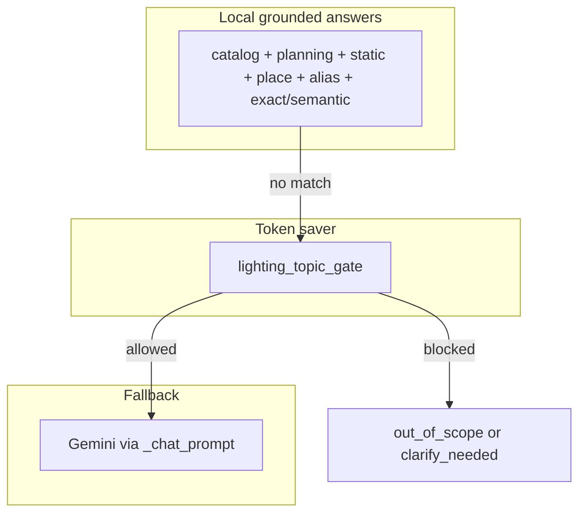

# Grounded LuxSCale chat (JSON-first) + gated Gemini (revised)

## Review summary (incorporated)

An honest read of [`chat_service.py`](c:\xampp\htdocs\LuxScaleAI-zetta\luxscale\chat_service.py) shows the **three-layer model (L0 → gate → Gemini)** is already in place. The following gaps from code review are **merged into this plan** and **reprioritized** below.

---

## Root cause: hospital / mixed place (deeper than “disambiguation first”)

**Problem:** [`_detect_place_canonical`](c:\xampp\htdocs\LuxScaleAI-zetta\luxscale\chat_service.py) + `heuristic_place_keywords` is **greedy / first-match**. “Hospital” often **does not** map to a canonical place, so resolution falls through; a later token like **“factory”** *does* match, producing the **wrong** standard row and task. Arabic terms (**مستشفى**, **مريض**, **عيادة**) are not recognized, so [`_missing_required_fields_for_planning`](c:\xampp\htdocs\LuxScaleAI-zetta\luxscale\chat_service.py) can still ask for “room type” even when the user said hospital.

**Do this before** fancy conflict rules:

1. Register **`Hospital`** (and sub-types: patient room, examination room, ward; **غرفة مريض**, **عيادة**, etc.) as a **canonical place** with `heuristic_place_keywords` and/or alias entries pointing at the right **EN 12464-1** rows in [`standards_cleaned.json`](c:\xampp\htdocs\LuxScaleAI-zetta\standards\standards_cleaned.json) (e.g. ref **5.3** for examination / clinical areas, wards, etc. — exact rows per your dataset).
2. Update [`standards_keywords_upgraded.json`](c:\xampp\htdocs\LuxScaleAI-zetta\standards\standards_keywords_upgraded.json) (or equivalent) so place → `standard_row` resolution is consistent.

**Then** add **conflict rules** (e.g. hospital + factory in one line): prefer explicit room type, or last strong place, or a **one-line clarify** — but only after “hospital” has a real mapping.

**Arabic planning:** [`_is_fixture_count_intent`](c:\xampp\htdocs\LuxScaleAI-zetta\luxscale\chat_service.py) already includes **كشاف/كشافات**; the real gap is **place detection**, not fixture terms.

---

## JSON-only: `tool_usage` static intent (highest ROI, minimal risk)

**Problem:** “What does this tool do” / “how do I use it” miss **`company_identity`** (which targets “who built it”) and miss planning → **gate** often has **no_signal** → **clarify**.

**Fix:** Add a **`tool_usage`** (or split **what_is_luxscale** / **how_to_use**) entry in [`fixed_responses.json`](c:\xampp\htdocs\LuxScaleAI-zetta\assets\fixed_responses.json) under **`static_intents`**, with:

- **English + Arabic patterns** in JSON (drives [`_static_intent_specs()`](c:\xampp\htdocs\LuxScaleAI-zetta\luxscale\chat_service.py) when the file provides `static_intents`).
- **`answers.en` and `answers.ar` inline** on the intent (or full `localized_answers` on the response) so the path stays **100% local**.

**Code change may be zero** if `static_intents` in JSON is already the source of truth for the running app.

---

## Hidden Gemini on “local” paths: `_translate_answer_if_needed`

**Problem:** If a static response lacks **`localized_answers.ar`**, [`_translate_answer_if_needed`](c:\xampp\htdocs\LuxScaleAI-zetta\luxscale\chat_service.py) can call **Gemini** for translation — turning a “local” answer into a **token spend**.

**Rule for new intents:** always ship **`answers.ar`** (or `localized_answers.ar` on the fixed response) for every new static block. Optionally add a follow-up task: short-circuit translation to a **no-op** or **stub** when `response_id` is in an allowlist of fully-local ids.

---

## `tool_usage` vs `company_identity`

Keep **company_identity** for designer/website; add **tool_usage** for capabilities and “how to get a design” (dimensions, lux, U0, open LuxSCale) without overlapping patterns.

---

## Reconciliation: go beyond lux/U0 and standard number

[`_reconcile_gemini_answer`](c:\xampp\htdocs\LuxScaleAI-zetta\luxscale\chat_service.py) (name in codebase) already handles wrong standard **number** and **lux/U0** drift for places. It does **not** remove **hallucinated fixture brands**. [`_append_local_fixture_block`](c:\xampp\htdocs\LuxScaleAI-zetta\luxscale\chat_service.py) **appends** catalog lines **after** Gemini, so a wrong “Philips BVP161” in the main paragraph can still appear.

**Add:**

- Extract candidate fixture/product tokens from Gemini text; compare **luminaire base names** to [`_fixture_entries()`](c:\xampp\htdocs\LuxScaleAI-zetta\luxscale\chat_service.py) (or catalog API names).
- Flag common **competitor brands** with a regex (e.g. `philips`, `osram`, `ledvance`, `trilux`, `siteco`, `cooper`, …) and append a **one-line correction** that LuxSCale only endorses **mapped SC/SV** products.

---

## Server-side: duplicate “who created” / feedback hijack

**Problem:** [`_yes_no_value`](c:\xampp\htdocs\LuxScaleAI-zetta\luxscale\chat_service.py) may match **yes** inside a longer message (e.g. “yes it does”), which can interact badly with **pending** feedback and [`handle_feedback`](c:\xampp\htdocs\LuxScaleAI-zetta\luxscale\chat_service.py).

**Fix:** Require the **entire** normalized message to be **only** a yes/no token (or a tiny allowlist of “y”/“n”), not a substring match in long text.

---

## Cache invalidation (JSON edits not visible until restart)

[`load_fixed_responses_doc`](c:\xampp\htdocs\LuxScaleAI-zetta\luxscale\chat_service.py), standards, and aliases use **`@lru_cache(maxsize=1)`**. New `static_intents` or hospital rows **won’t load** until process restart or manual clear.

**Options (pick one):**

- **Admin route** e.g. `POST /api/.../reload-dicts` calling `cache_clear()` on each loader, or
- **Lightweight mtime check** inside loaders (compare file mtime to last load).

Document in ops README so “JSON not working” is not misdiagnosed.

---

## Workstream: Gemini prompt (unchanged in spirit, after above)

- [**`_chat_prompt`**](c:\xampp\htdocs\LuxScaleAI-zetta\luxscale\chat_service.py): inject a **full or chunked allowlist** of allowed luminaires; reinforce EN 12464-1 and Short Circuit / catalog only.
- Optional **[`app_settings`](c:\xampp\htdocs\LuxScaleAI-zetta\luxscale\app_settings.py)**: `strict_lighting_for_gemini` second check before `ask_gemini_text`.

---

## Workstream 4 (clarify / client) — narrowed

- Server **clarify** is **one-shot** per intent in-session, then **`force_gemini`**. **`_CLARIFY_TTL_SECONDS`** (e.g. 12 min) means a **new** clarify after expiry is expected — not necessarily a bug.
- **UI:** if the client shows a permanent clarify widget, it should use **`already_clarified`** from the API to avoid duplicate prompts.
- **“Failed to fetch”** is **network**; not fixed by routing — retry UX only.

---

## Architecture diagram (unchanged)

---

## Recommended implementation order (revised)

1. **JSON-only:** `tool_usage` (and any split intents) in [`fixed_responses.json`](c:\xampp\htdocs\LuxScaleAI-zetta\assets\fixed_responses.json) `static_intents` + **`answers.ar`** / **`answers.en`** — **no code** if JSON drives specs; ship first.
2. **Code + JSON:** **Hospital** canonical place + sub-types + **EN 12464-1** row mapping in standards + keywords (fixes NLU and mixed messages in one move).
3. **Code:** **Fixture/brand** audit in [`_reconcile_gemini_answer`](c:\xampp\htdocs\LuxScaleAI-zetta\luxscale\chat_service.py).
4. **Code:** **Standalone-only** [`_yes_no_value`](c:\xampp\htdocs\LuxScaleAI-zetta\luxscale\chat_service.py).
5. **Code:** **Cache reload** or mtime invalidation for dict loaders.
6. **Code:** **Prompt allowlist** expansion + optional **strict_lighting_for_gemini**.
7. **Optional:** translation policy for static paths (see **Hidden Gemini** above).

---

## Files to touch (primary)

- [`assets/fixed_responses.json`](c:\xampp\htdocs\LuxScaleAI-zetta\assets\fixed_responses.json) — `static_intents`, new responses, `match_hints` if needed  
- [`standards/standards_cleaned.json`](c:\xampp\htdocs\LuxScaleAI-zetta\standards\standards_cleaned.json) — hospital-related rows (verify 5.3 and related)  
- [`standards/standards_keywords_upgraded.json`](c:\xampp\htdocs\LuxScaleAI-zetta\standards\standards_keywords_upgraded.json) — place → ref  
- [`luxscale/chat_service.py`](c:\xampp\htdocs\LuxScaleAI-zetta\luxscale\chat_service.py) — reconcile, yes/no, place heuristics, optional gate, cache clear hooks  
- [`luxscale/ai_routes.py`](c:\xampp\htdocs\LuxScaleAI-zetta\luxscale\ai_routes.py) — reload endpoint if chosen  
- [`tests/chat/`](c:\xampp\htdocs\LuxScaleAI-zetta\tests\chat\)

## Out of scope (unless asked)

- Replacing Gemini entirely; non-lighting small talk beyond [`_out_of_scope_answer`](c:\xampp\htdocs\LuxScaleAI-zetta\luxscale\chat_service.py).
